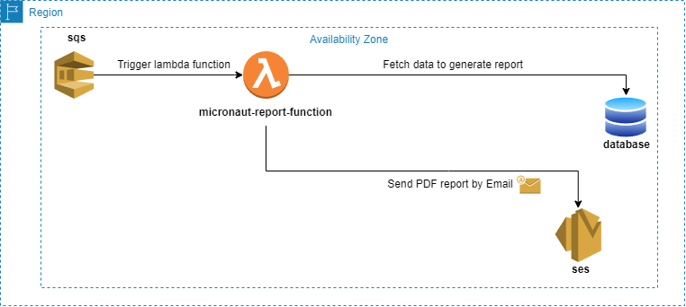

# micronaut-report-function
Proof of concept using AWS Lambda, SQS, SES, Jasper Reports and Java



- [x] [Micronaut 3.9.1](https://micronaut.io/)
- [x] [Micronaut Data](https://micronaut-projects.github.io/micronaut-data/latest/guide/)
- [x] [Micronaut Test Resources](https://micronaut-projects.github.io/micronaut-test-resources/latest/guide/)
- [x] [IReport 6.20](https://sourceforge.net/projects/jasperstudio/files/JaspersoftStudio-6.20.0/)
- [x] [Test containers](https://testcontainers.com/guides/getting-started-with-testcontainers-for-java/?_gl=1*1a5uv1a*_up*MQ..*_ga*MzEwODQyMzU4LjE2OTA3NTc3Mzg.*_ga_22TYV8FBPD*MTY5MDc1NzczNS4xLjAuMTY5MDc1NzczNS4wLjAuMA)
- [x] Java 17
- [x] Docker
- [x] Postgres

### Build for JVM execution
```console
micronaut-report-function % make build
```

### Integration tests

Using test resources, some containers will be created automatically during the execution of the tests.

- [Localstack SES using test containers](https://github.com/fbourguignon/micronaut-report-function/blob/main/src/test/java/integration/SESLocalStackClientFactory.java#L21)
- [PostgresSQL using test resources](https://github.com/fbourguignon/micronaut-report-function/blob/main/src/test/resources/application.yml#L7)

```console
micronaut-report-function % make build
```